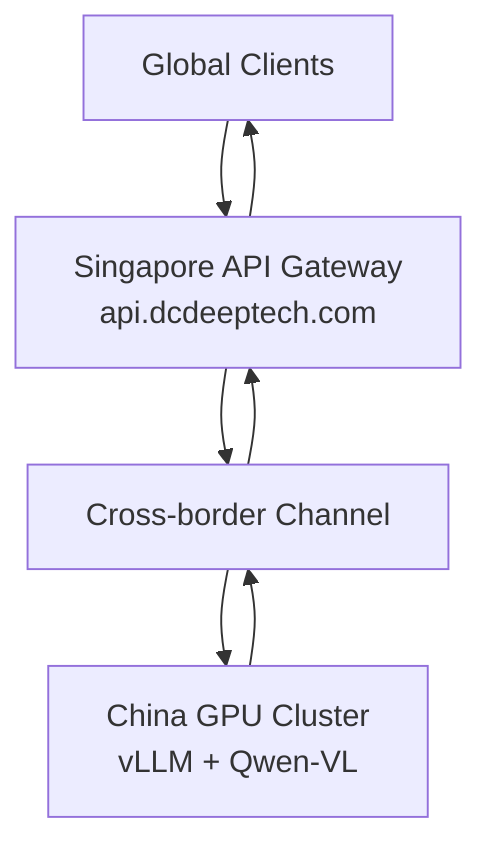

# 🌏 DCDeepTech AI Gateway — SG-CN

**Singapore–China Cross-Border AI Gateway (OpenAI-Compatible)**


> **Repo:** `github.com/luoxisg/dcdeeptech` · branch `main/SG-CN`
> **Gateway domain:** `api.dcdeeptech.com`

---

## 📑 Table of Contents

- [Overview](#overview)
- [Architecture](#architecture)
- [Features](#features)
- [Tech Stack](#tech-stack)
- [Project Structure](#project-structure)
- [Installation](#installation)
- [Configuration](#configuration)
- [Run](#run)
- [API Usage](#api-usage)
- [Get API Key](#get-api-key)
- [Pricing](#pricing)
- [Production Notes](#production-notes)
- [Success Criteria](#success-criteria)
- [Roadmap](#roadmap)

---

## Overview

This project implements the core gateway logic for `api.dcdeeptech.com` — a Singapore-side API layer that sits between global clients and China-side GPU inference infrastructure, exposing an OpenAI-compatible interface while handling authentication, request normalization, response adaptation, streaming, and operational observability.

```
Global Clients
      ↓  Authorization: Bearer <GATEWAY_API_KEY>
Singapore API Gateway — api.dcdeeptech.com
      ↓  Cross-border Channel
      ↓  Authorization: Bearer <SOPHNET_API_KEY>
China GPU Cluster — vLLM + Qwen-VL
      ↓
OpenAI-Compatible Response
```

> **Deployment region:** Singapore `ap-southeast-1`

---

## Architecture



### Gateway Responsibilities

- Exposing OpenAI-compatible endpoints
- Authenticating clients with Bearer token
- Forwarding requests to upstream inference services
- Normalizing upstream responses to OpenAI schema
- Supporting Qwen-VL multimodal (text + image) input
- Supporting standard and streaming chat completions
- Health checks, model listing, request logging, request tracing

---

## Features

| Feature | Description |
|---|---|
| **OpenAI-compatible API** | Swap base URL, no client changes needed |
| **Multimodal support** | Qwen-VL handles text + image input |
| **Bearer token auth** | Same pattern as OpenAI |
| **Cross-border routing** | Singapore ↔ China optimised link |
| **Protocol adapter** | Normalises vLLM → OpenAI schema |
| **SSE streaming proxy** | Nginx buffering disabled for real-time push |
| **Health check** | `/health` with upstream ping |
| **Request tracing** | `X-Request-ID` on every response |
| **Unknown params pass-through** | Future-proof `extra="allow"` |

---

## Tech Stack

| Component | Technology |
|---|---|
| Gateway Framework | FastAPI |
| HTTP Client | httpx (async, shared client) |
| ASGI Server | Uvicorn |
| Config | pydantic-settings + python-dotenv |
| Inference Backend | vLLM |
| Model | Qwen-VL (multimodal) |
| Auth | HTTPBearer middleware |

---

## Project Structure

All source files are **flat inside `SG-CN/`** — there is no `routes/` or `utils/` sub-package.

```
SG-CN/
├── main.py           # FastAPI app entry: middleware, routers, lifespan
├── config.py         # pydantic-settings: loads all env vars from .env
├── auth.py           # HTTPBearer dependency for all /v1/* routes
├── models.py         # Pydantic schemas: text + image_url multimodal
├── adapters.py       # adapt_request / adapt_response / adapt_model_list
├── chat.py           # POST /v1/chat/completions (stream + non-stream)
├── health.py         # GET /health — upstream ping, no auth
├── logging.py        # configure_logging(), quiets noisy libs
├── request_id.py     # RequestIDMiddleware — X-Request-ID header
├── mvp.py            # Minimal single-file PoC prototype (reference only)
├── .env.example      # Environment variable template
├── Dockerfile        # python:3.12-slim, uvicorn entrypoint
├── requirements.txt  # Runtime + test dependencies
├── tests/            # pytest suite (auth, chat, health, models, adapters)
├── MVP.md            # PoC design notes
├── README01.md       # Original generated README
└── readme02.md       # Architecture deep-dive README
```

### File Breakdown

| File | Role |
|---|---|
| `main.py` | App factory + lifespan: initialises shared `httpx.AsyncClient`, mounts middleware and all routers. |
| `config.py` | Loads all env vars from `.env` via `pydantic-settings` with type coercion. |
| `auth.py` | `HTTPBearer` dependency reused by all `/v1/*` routes via `Depends(verify_api_key)`. |
| `models.py` | Full Pydantic schemas: `ContentPart` union (`text` + `image_url`), `ChatMessage`, `ChatCompletionRequest`, response models. |
| `adapters.py` | Three normaliser functions: `adapt_request_to_upstream`, `adapt_response_to_openai`, `adapt_model_list_to_openai`. |
| `chat.py` | `POST /v1/chat/completions` — streaming via `httpx.stream()` + `X-Accel-Buffering: no`; non-streaming returns full JSON. |
| `health.py` | `GET /health` — best-effort upstream ping; upstream failure never fails the health check itself. |
| `logging.py` | `configure_logging()` — clean stdout format, suppresses `httpx`/`uvicorn` noise. |
| `request_id.py` | Starlette middleware that injects `X-Request-ID` into every request/response. |
| `mvp.py` | Minimal single-file prototype used during initial PoC — for reference only. |

**Total: ~840 lines of production-oriented Python.**

---

## Installation

```bash
# Clone — sparse-checkout pulls only SG-CN/
git clone --no-checkout https://github.com/luoxisg/dcdeeptech.git
cd dcdeeptech
git sparse-checkout init --cone
git sparse-checkout set SG-CN
git checkout main
cd SG-CN

# Or clone full repo
# git clone https://github.com/luoxisg/dcdeeptech.git && cd dcdeeptech/SG-CN

# Create virtualenv
python3.12 -m venv .venv
source .venv/bin/activate        # Windows: .venv\Scripts\activate

# Install dependencies
pip install -r requirements.txt
```

---

## Configuration

Copy `.env.example` to `.env` and fill in your values:

```bash
cp .env.example .env
```

```env
# Gateway settings
GATEWAY_API_KEY=your-gateway-api-key
GATEWAY_HOST=0.0.0.0
GATEWAY_PORT=8000

# Upstream China-side inference
SOPHNET_API_URL=https://your-china-endpoint
SOPHNET_API_KEY=your-upstream-key
SOPHNET_AUTH_MODE=bearer

# Model & timeout
DEFAULT_MODEL=qwenvl
REQUEST_TIMEOUT=60
```

| Variable | Required | Description |
|---|---|---|
| `GATEWAY_API_KEY` | ✅ | Bearer token clients must supply |
| `GATEWAY_HOST` | | Bind address, default `0.0.0.0` |
| `GATEWAY_PORT` | | Bind port, default `8000` |
| `SOPHNET_API_URL` | ✅ | Base URL of China-side inference backend |
| `SOPHNET_API_KEY` | ✅ | Upstream API key |
| `SOPHNET_AUTH_MODE` | | `bearer` (default) or `none` |
| `DEFAULT_MODEL` | | Fallback model name, default `qwenvl` |
| `REQUEST_TIMEOUT` | | Upstream timeout in seconds, default `60` |

> ⚠️ **Never commit `.env` to git — it is already in `.gitignore`.**

---

## Run

### Local / development

```bash
uvicorn main:app --host 0.0.0.0 --port 8000 --reload
```

Or use the bundled entry point:

```bash
python main.py
```

### Production (Singapore server)

```bash
uvicorn main:app --host 0.0.0.0 --port 8000 --workers 4
```

> Single worker is sufficient for pure async workloads — scale horizontally with replicas instead.

### systemd Service

```bash
sudo tee /etc/systemd/system/ai-gateway.service > /dev/null <<'EOF'
[Unit]
Description=DCDeepTech AI Gateway (SG-CN)
After=network.target

[Service]
User=ubuntu
WorkingDirectory=/home/ubuntu/dcdeeptech/SG-CN
EnvironmentFile=/home/ubuntu/dcdeeptech/SG-CN/.env
ExecStart=/home/ubuntu/dcdeeptech/SG-CN/.venv/bin/uvicorn \
          main:app --host 0.0.0.0 --port 8000
Restart=always
RestartSec=5

[Install]
WantedBy=multi-user.target
EOF

sudo systemctl daemon-reload
sudo systemctl enable --now ai-gateway
sudo journalctl -u ai-gateway -f   # live logs
```

### Docker

```bash
# Build
docker build -t dcdeeptech-gateway .

# Run
docker run -d \
  --name gateway \
  --env-file .env \
  -p 8000:8000 \
  --restart unless-stopped \
  dcdeeptech-gateway

# Logs
docker logs -f gateway
```

---

## API Usage

**Base URL:** `https://api.dcdeeptech.com` (production) or `http://localhost:8000` (local)

With the official OpenAI Python SDK — just swap `base_url`:

```python
from openai import OpenAI

client = OpenAI(
    base_url="https://api.dcdeeptech.com/v1",
    api_key="your-gateway-api-key",
)

response = client.chat.completions.create(
    model="qwenvl",
    messages=[{"role": "user", "content": "Hello from Singapore!"}],
)
print(response.choices[0].message.content)
```

---

### `GET /health` — Health Check

No authentication required.

```bash
curl https://api.dcdeeptech.com/health
```

```json
{
  "status": "ok",
  "service": "DCDeepTech AI Gateway",
  "region": "Singapore",
  "timestamp": 1710000000,
  "upstream": { "reachable": true, "status": 200 }
}
```

---

### `GET /v1/models` — List Models

```bash
curl https://api.dcdeeptech.com/v1/models \
  -H "Authorization: Bearer $GATEWAY_API_KEY"
```

```json
{
  "object": "list",
  "data": [
    { "id": "qwenvl", "object": "model", "created": 1710000000, "owned_by": "dcdeeptech" }
  ]
}
```

---

### `POST /v1/chat/completions` — Text Chat

```bash
curl https://api.dcdeeptech.com/v1/chat/completions \
  -H "Authorization: Bearer $GATEWAY_API_KEY" \
  -H "Content-Type: application/json" \
  -d '{
    "model": "qwenvl",
    "messages": [{"role": "user", "content": "What is the capital of Singapore?"}]
  }'
```

---

### Streaming

```bash
curl https://api.dcdeeptech.com/v1/chat/completions \
  -H "Authorization: Bearer $GATEWAY_API_KEY" \
  -H "Content-Type: application/json" \
  -d '{
    "model": "qwenvl",
    "stream": true,
    "messages": [{"role": "user", "content": "Tell me a joke."}]
  }'
```

---

### Multimodal — Qwen-VL Image Input

```bash
curl https://api.dcdeeptech.com/v1/chat/completions \
  -H "Authorization: Bearer $GATEWAY_API_KEY" \
  -H "Content-Type: application/json" \
  -d '{
    "model": "qwenvl",
    "messages": [{
      "role": "user",
      "content": [
        {"type": "image_url", "image_url": {"url": "https://example.com/image.jpg"}},
        {"type": "text", "text": "Describe this image."}
      ]
    }]
  }'
```

> Replace `https://api.dcdeeptech.com` with `http://localhost:8000` for local testing.

---

## Get API Key

> Developer access is currently available via **invitation / waitlist** during the POC phase.

### How to Apply

1. Email **[info@dcdeeptech.com](mailto:info@dcdeeptech.com)** — subject: `API Key Request`
2. Include your name, company, and intended use case
3. Receive your `sk-xxxx` key within 1–2 business days

### What You Receive

| Item | Detail |
|---|---|
| API Key | `sk-xxxxxxxxxxxxxxxx` — keep secret, never commit to git |
| Base URL | `https://api.dcdeeptech.com` |
| Default Quota | 100,000 tokens / day (POC tier) |
| Models | `qwenvl` (text + multimodal) |

```bash
# Recommended: set as environment variable
export DCDEEPTECH_API_KEY="sk-xxxx"

curl https://api.dcdeeptech.com/v1/chat/completions \
  -H "Authorization: Bearer $DCDEEPTECH_API_KEY" \
  ...
```

> ⚠️ **Security:** If you suspect your key is compromised, rotate it immediately at [info@dcdeeptech.com](mailto:info@dcdeeptech.com).

---

## Pricing

> POC phase pricing — subject to change in Phase 2.

### Token Pricing — Qwen-VL

| Type | Unit | Price (USD) |
|---|---|---|
| Input tokens — text | per 1M tokens | $0.50 |
| Output tokens — text | per 1M tokens | $1.50 |
| Input — image | per image | $0.003 |
| Minimum charge | per request | — (none) |

> **Example:** 500 input + 200 output tokens ≈ **$0.00058**

### POC Free Tier

| Tier | Quota | Price |
|---|---|---|
| POC Developer | 100,000 tokens / day | **Free** during POC |
| Overage | Beyond daily quota | Returns `429` — contact us |

### Billing Notes

- Text token counting follows **OpenAI tiktoken** convention
- Images billed as **flat fee per image** regardless of resolution (POC)
- Streaming (`"stream": true`) billed identically to non-streaming
- Usage logs available on request; self-serve dashboard coming in Phase 3

### Future Pricing — Phase 2 Roadmap

| Tier | Monthly Volume | Est. Price |
|---|---|---|
| Starter | up to 10M tokens | ~$10 / month |
| Growth | up to 100M tokens | ~$80 / month |
| Enterprise | Custom | Contact us |

---

## Production Notes

### 1. Shared `httpx` Client

A single `httpx.AsyncClient` is shared across all requests via `app.state`, avoiding per-request TCP connection overhead. This is especially impactful for cross-border traffic where repeated handshakes materially increase latency.

### 2. Streaming Error Handling

When upstream streaming fails, the gateway emits a valid SSE `data:` error event instead of crashing mid-stream, giving clients a clean, protocol-compatible failure signal.

### 3. Unknown Parameter Pass-Through

`ChatCompletionRequest` uses `model_config = {"extra": "allow"}`, so unknown OpenAI-compatible parameters (`logit_bias`, `seed`, `tools`, etc.) pass through automatically without explicit modelling. This keeps the gateway future-proof against evolving client SDKs.

### 4. Stateless Design

The gateway holds no per-request state — safe to run multiple replicas behind a load balancer. Scale horizontally at the container / Kubernetes level.

### 5. Secret Safety

`GATEWAY_API_KEY` and `SOPHNET_API_KEY` are never written to logs. `X-Request-ID` is generated per request and echoed in responses for distributed tracing.

---

## Success Criteria

| Criteria | Target |
|---|---|
| API callable from Singapore | ✅ |
| Text response correct | ✅ |
| Multimodal response correct (image+text via Qwen-VL) | ✅ |
| Success rate | ≥ 95% |
| P99 latency — text | ≤ 5s |

---

## Roadmap

| Phase | Scope | Status |
|---|---|---|
| Phase 1 | POC — basic routing, Qwen-VL, Singapore deployment | 🟡 In Progress |
| Phase 2 | Billing — usage metering, per-key quotas, dashboard | ⬜ Planned |
| Phase 3 | Platform — multi-model, HA, self-serve portal | ⬜ Planned |

---

## License

MIT

---

> **Contact:** [info@dcdeeptech.com](mailto:info@dcdeeptech.com)
> **Docs:** See `MVP.md` for PoC design notes · `README01.md` / `readme02.md` for architecture deep-dives
