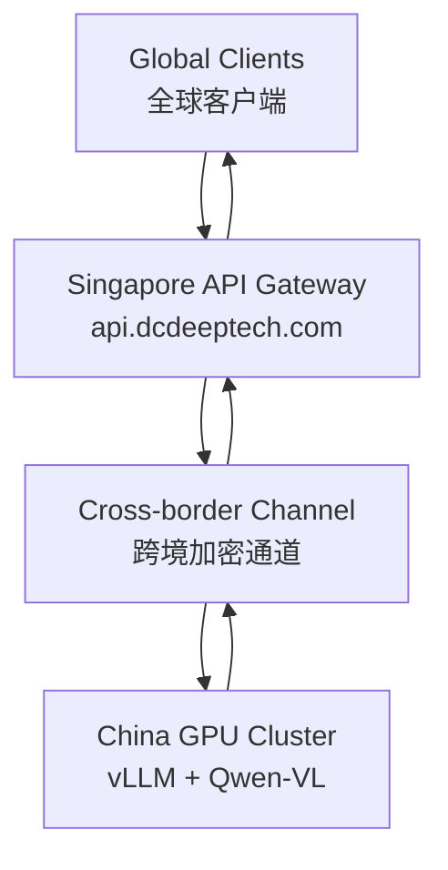

# 🌏 DCDeepTech AI Gateway — SG-CN

**Singapore–China Cross-Border AI Gateway (OpenAI-Compatible)**
**新加坡—中国跨境 AI 网关（OpenAI 兼容接口）**


> **Repo:** `github.com/luoxisg/dcdeeptech` · branch `main/SG-CN`
> **Gateway domain:** `api.dcdeeptech.com`

---

## 📑 Table of Contents / 目录

- [Overview / 项目概述](#overview--项目概述)
- [Architecture / 架构](#architecture--架构)
- [Features / 功能特性](#features--功能特性)
- [Tech Stack / 技术栈](#tech-stack--技术栈)
- [Project Structure / 项目结构](#project-structure--项目结构)
- [Installation / 安装](#installation--安装)
- [Configuration / 配置](#configuration--配置)
- [Run / 启动](#run--启动)
- [API Usage / 接口使用](#api-usage--接口使用)
- [Get API Key / 获取 API Key](#get-api-key--获取-api-key)
- [Pricing / 计费说明](#pricing--计费说明)
- [Production Notes / 生产特性说明](#production-notes--生产特性说明)
- [Success Criteria / 验收标准](#success-criteria--验收标准)
- [Roadmap / 路线图](#roadmap--路线图)

---

## Overview / 项目概述

This project implements the core gateway logic for `api.dcdeeptech.com` — a Singapore-side API layer that sits between global clients and China-side GPU inference infrastructure, exposing an OpenAI-compatible interface while handling authentication, request normalization, response adaptation, streaming, and operational observability.

本项目实现了 `api.dcdeeptech.com` 的核心网关逻辑。它被设计为部署在新加坡侧的 API 层，位于全球客户端与中国侧推理基础设施之间，对外提供 OpenAI 兼容接口，同时处理鉴权、请求规范化、响应适配、流式传输和运行可观测性。

```
Global Clients  全球客户端
      ↓  Authorization: Bearer <GATEWAY_API_KEY>
Singapore API Gateway — api.dcdeeptech.com  新加坡网关
      ↓  Cross-border Channel  跨境通道
      ↓  Authorization: Bearer <SOPHNET_API_KEY>
China GPU Cluster — vLLM + Qwen-VL  中国 GPU 集群
      ↓
OpenAI-Compatible Response  OpenAI 兼容响应
```

> **Deployment region / 部署区域:** Singapore `ap-southeast-1`

---

## Architecture / 架构



### Gateway Responsibilities / 网关职责

The gateway handles: / 网关承担以下职责：

- Exposing OpenAI-compatible endpoints / 对外暴露 OpenAI 兼容接口
- Authenticating clients with Bearer token / 使用 Bearer Token 对客户端请求进行鉴权
- Forwarding requests to upstream inference services / 将请求转发到上游推理服务
- Normalizing upstream responses to OpenAI schema / 将上游响应规范化为 OpenAI 格式
- Supporting Qwen-VL multimodal (text + image) input / 支持 Qwen-VL 多模态（图文）输入
- Supporting standard and streaming chat completions / 支持普通与流式聊天补全
- Health checks, model listing, request logging, request tracing / 健康检查、模型列表、日志与请求追踪

---

## Features / 功能特性

| Feature | 功能 |
|---|---|
| **OpenAI-compatible API** — swap base URL, no client changes | **OpenAI 兼容接口** — 仅替换 Base URL，无需修改客户端 |
| **Multimodal support** — Qwen-VL handles text + image | **多模态支持** — Qwen-VL 支持图文混合输入 |
| **Bearer token auth** — same pattern as OpenAI | **Bearer Token 鉴权** — 与 OpenAI 鉴权方式一致 |
| **Cross-border routing** — Singapore ↔ China optimised | **跨境路由** — 新加坡 ↔ 中国优化链路 |
| **Protocol adapter** — normalises vLLM → OpenAI schema | **协议适配** — 将 vLLM 响应标准化为 OpenAI schema |
| **SSE streaming proxy** — with Nginx buffering disabled | **SSE 流式代理** — 禁用 Nginx 缓冲，保证实时推送 |
| **Health check** — `/health` with upstream ping | **健康检查** — `/health` 含上游连通性探测 |
| **Request tracing** — `X-Request-ID` on every response | **请求追踪** — 每个响应携带 `X-Request-ID` |
| **Unknown params pass-through** — future-proof `extra="allow"` | **参数透传** — `extra="allow"` 自动透传未知 OAI 参数 |

---

## Tech Stack / 技术栈

| Component | Technology |
|---|---|
| Gateway Framework | FastAPI |
| HTTP Client | httpx (async, shared client) |
| ASGI Server | Uvicorn |
| Config | pydantic-settings + python-dotenv |
| Inference Backend | vLLM |
| Model | Qwen-VL (multimodal) |
| Auth | HTTPBearer middleware |

---

## Project Structure / 项目结构

All source files are **flat inside `SG-CN/`** — there is no `routes/` or `utils/` sub-package.
所有源文件**平铺于 `SG-CN/` 目录下**，无 `routes/` 或 `utils/` 子包层级。

```
SG-CN/
├── main.py           # FastAPI app entry: middleware, routers, lifespan  应用入口
├── config.py         # pydantic-settings: loads all env vars from .env  环境变量加载
├── auth.py           # HTTPBearer dependency for all /v1/* routes  Bearer 鉴权依赖
├── models.py         # Pydantic schemas: text + image_url multimodal  请求/响应模型
├── adapters.py       # adapt_request / adapt_response / adapt_model_list  协议适配层
├── chat.py           # POST /v1/chat/completions (stream + non-stream)  对话路由
├── health.py         # GET /health — upstream ping, no auth  健康检查
├── logging.py        # configure_logging(), quiets noisy libs  日志配置
├── request_id.py     # RequestIDMiddleware — X-Request-ID header  请求 ID 中间件
├── mvp.py            # Minimal single-file PoC prototype (reference only)  单文件原型
├── .env.example      # Environment variable template  环境变量模板
├── Dockerfile        # python:3.12-slim, uvicorn entrypoint  容器镜像
├── requirements.txt  # Runtime + test dependencies  依赖清单
├── tests/            # pytest suite (auth, chat, health, models, adapters)  测试套件
├── MVP.md            # PoC design notes  PoC 设计说明
├── README01.md       # Original generated README
└── readme02.md       # Architecture deep-dive README
```

### File Breakdown / 文件说明

| File | Role / 功能 |
|---|---|
| `main.py` | App factory + lifespan: initialises shared `httpx.AsyncClient`, mounts middleware and all routers. / 应用工厂与生命周期，共享客户端初始化，挂载中间件与路由。 |
| `config.py` | Loads all env vars from `.env` via `pydantic-settings` with type coercion. / 通过 `pydantic-settings` 加载全部环境变量并做类型转换。 |
| `auth.py` | `HTTPBearer` dependency reused by all `/v1/*` routes via `Depends(verify_api_key)`. / Bearer 鉴权依赖，统一注入所有 `/v1/*` 路由。 |
| `models.py` | Full Pydantic schemas: `ContentPart` union (`text` + `image_url`), `ChatMessage`, `ChatCompletionRequest`, response models. / 完整 Pydantic 模型，含多模态 `image_url` 内容部分。 |
| `adapters.py` | Three normaliser functions: `adapt_request_to_upstream`, `adapt_response_to_openai`, `adapt_model_list_to_openai`. / 三个协议归一化函数，优雅处理字段缺失。 |
| `chat.py` | `POST /v1/chat/completions` — streaming via `httpx.stream()` + `X-Accel-Buffering: no`; non-streaming returns full JSON. / 流式与非流式对话，SSE 代理禁用 Nginx 缓冲。 |
| `health.py` | `GET /health` — best-effort upstream ping; upstream failure never fails the health check itself. / 健康检查，上游失败不影响端点本身返回 200。 |
| `logging.py` | `configure_logging()` — clean stdout format, suppresses `httpx`/`uvicorn` noise. / 日志配置，压低第三方库噪音。 |
| `request_id.py` | Starlette middleware that injects `X-Request-ID` into every request/response. / 中间件，为每对请求/响应注入追踪 ID。 |
| `mvp.py` | Minimal single-file prototype used during initial PoC — for reference only. / 初期 PoC 单文件原型，仅供参考。 |

**Total: ~840 lines of production-oriented Python. / 共约 840 行面向生产环境的 Python 代码。**

---

## Installation / 安装

```bash
# Clone — sparse-checkout pulls only SG-CN/  仅拉取 SG-CN/ 目录
git clone --no-checkout https://github.com/luoxisg/dcdeeptech.git
cd dcdeeptech
git sparse-checkout init --cone
git sparse-checkout set SG-CN
git checkout main
cd SG-CN

# Or clone full repo  或克隆完整仓库
# git clone https://github.com/luoxisg/dcdeeptech.git && cd dcdeeptech/SG-CN

# Create virtualenv  创建虚拟环境
python3.12 -m venv .venv
source .venv/bin/activate        # Windows: .venv\Scripts\activate

# Install dependencies  安装依赖
pip install -r requirements.txt
```

---

## Configuration / 配置

Copy `.env.example` to `.env` and fill in your values:
将 `.env.example` 复制为 `.env` 并填写真实值：

```bash
cp .env.example .env
```

```env
# Gateway settings  网关配置
GATEWAY_API_KEY=your-gateway-api-key
GATEWAY_HOST=0.0.0.0
GATEWAY_PORT=8000

# Upstream China-side inference  上游中国侧推理服务
SOPHNET_API_URL=https://your-china-endpoint
SOPHNET_API_KEY=your-upstream-key
SOPHNET_AUTH_MODE=bearer

# Model & timeout  模型与超时
DEFAULT_MODEL=qwenvl
REQUEST_TIMEOUT=60
```

| Variable | Required | Description / 说明 |
|---|---|---|
| `GATEWAY_API_KEY` | ✅ | Bearer token clients must supply / 客户端鉴权 Token |
| `GATEWAY_HOST` | | Bind address, default `0.0.0.0` / 绑定地址 |
| `GATEWAY_PORT` | | Bind port, default `8000` / 监听端口 |
| `SOPHNET_API_URL` | ✅ | Base URL of China-side inference backend / 中国侧接入地址 |
| `SOPHNET_API_KEY` | ✅ | Upstream API key / 上游 API Key |
| `SOPHNET_AUTH_MODE` | | `bearer` (default) or `none` / 上游鉴权方式 |
| `DEFAULT_MODEL` | | Fallback model name / 默认模型名，默认 `qwenvl` |
| `REQUEST_TIMEOUT` | | Upstream timeout in seconds / 上游超时秒数，默认 `60` |

> ⚠️ **Never commit `.env` to git — it is already in `.gitignore`.**
> **请勿将 `.env` 提交至 git，`.gitignore` 已默认排除该文件。**

---

## Run / 启动

### Local / development 本地开发

```bash
uvicorn main:app --host 0.0.0.0 --port 8000 --reload
```

Or use the bundled entry point: / 或使用内置入口：

```bash
python main.py
```

### Production (Singapore server) 生产环境

```bash
uvicorn main:app --host 0.0.0.0 --port 8000 --workers 4
```

> Single worker is sufficient for pure async workloads — scale horizontally with replicas instead.
> 纯异步负载单 worker 即可，建议通过水平扩容（多副本）替代多 worker。

### systemd Service  持久运行

```bash
sudo tee /etc/systemd/system/ai-gateway.service > /dev/null <<'EOF'
[Unit]
Description=DCDeepTech AI Gateway (SG-CN)
After=network.target

[Service]
User=ubuntu
WorkingDirectory=/home/ubuntu/dcdeeptech/SG-CN
EnvironmentFile=/home/ubuntu/dcdeeptech/SG-CN/.env
ExecStart=/home/ubuntu/dcdeeptech/SG-CN/.venv/bin/uvicorn \
          main:app --host 0.0.0.0 --port 8000
Restart=always
RestartSec=5

[Install]
WantedBy=multi-user.target
EOF

sudo systemctl daemon-reload
sudo systemctl enable --now ai-gateway
sudo journalctl -u ai-gateway -f   # live logs  实时日志
```

### Docker 容器部署

```bash
# Build  构建
docker build -t dcdeeptech-gateway .

# Run  运行
docker run -d \
  --name gateway \
  --env-file .env \
  -p 8000:8000 \
  --restart unless-stopped \
  dcdeeptech-gateway

# Logs  日志
docker logs -f gateway
```

---

## API Usage / 接口使用

**Base URL:** `https://api.dcdeeptech.com` (production) or `http://localhost:8000` (local)

With the official OpenAI Python SDK — just swap `base_url`:
使用官方 OpenAI Python SDK，仅替换 `base_url`：

```python
from openai import OpenAI

client = OpenAI(
    base_url="https://api.dcdeeptech.com/v1",
    api_key="your-gateway-api-key",
)

response = client.chat.completions.create(
    model="qwenvl",
    messages=[{"role": "user", "content": "Hello from Singapore!"}],
)
print(response.choices[0].message.content)
```

---

### `GET /health` — Health Check  健康检查

No authentication required. / 无需鉴权。

```bash
curl https://api.dcdeeptech.com/health
```

```json
{
  "status": "ok",
  "service": "DCDeepTech AI Gateway",
  "region": "Singapore",
  "timestamp": 1710000000,
  "upstream": { "reachable": true, "status": 200 }
}
```

---

### `GET /v1/models` — List Models  模型列表

```bash
curl https://api.dcdeeptech.com/v1/models \
  -H "Authorization: Bearer $GATEWAY_API_KEY"
```

```json
{
  "object": "list",
  "data": [
    { "id": "qwenvl", "object": "model", "created": 1710000000, "owned_by": "dcdeeptech" }
  ]
}
```

---

### `POST /v1/chat/completions` — Text Chat  文本对话

```bash
curl https://api.dcdeeptech.com/v1/chat/completions \
  -H "Authorization: Bearer $GATEWAY_API_KEY" \
  -H "Content-Type: application/json" \
  -d '{
    "model": "qwenvl",
    "messages": [{"role": "user", "content": "What is the capital of Singapore?"}]
  }'
```

---

### Streaming 流式输出

```bash
curl https://api.dcdeeptech.com/v1/chat/completions \
  -H "Authorization: Bearer $GATEWAY_API_KEY" \
  -H "Content-Type: application/json" \
  -d '{
    "model": "qwenvl",
    "stream": true,
    "messages": [{"role": "user", "content": "Tell me a joke."}]
  }'
```

---

### Multimodal — Qwen-VL Image Input  多模态图片输入

```bash
curl https://api.dcdeeptech.com/v1/chat/completions \
  -H "Authorization: Bearer $GATEWAY_API_KEY" \
  -H "Content-Type: application/json" \
  -d '{
    "model": "qwenvl",
    "messages": [{
      "role": "user",
      "content": [
        {"type": "image_url", "image_url": {"url": "https://example.com/image.jpg"}},
        {"type": "text", "text": "Describe this image. 请描述这张图片。"}
      ]
    }]
  }'
```

> Replace `https://api.dcdeeptech.com` with `http://localhost:8000` for local testing.
> 本地测试时将域名替换为 `http://localhost:8000`。

---

## Get API Key / 获取 API Key

> Developer access is currently available via **invitation / waitlist** during the POC phase.
> POC 阶段目前通过**邀请 / 申请**方式开放。

### How to Apply / 申请方式

1. Email **[info@dcdeeptech.com](mailto:info@dcdeeptech.com)** — subject: `API Key Request / API Key 申请`
2. Include your name, company, and intended use case / 注明姓名、公司及使用场景
3. Receive your `sk-xxxx` key within 1–2 business days / 1–2 个工作日内收到 Key

### What You Receive / 你将获得

| Item | Detail |
|---|---|
| API Key | `sk-xxxxxxxxxxxxxxxx` — keep secret, never commit to git |
| Base URL | `https://api.dcdeeptech.com` |
| Default Quota | 100,000 tokens / day (POC tier) / 每日 10 万 tokens（POC 档）|
| Models | `qwenvl` (text + multimodal) / 文本 + 多模态 |

```bash
# Recommended: set as environment variable  推荐：设为环境变量
export DCDEEPTECH_API_KEY="sk-xxxx"

curl https://api.dcdeeptech.com/v1/chat/completions \
  -H "Authorization: Bearer $DCDEEPTECH_API_KEY" \
  ...
```

> ⚠️ **Security:** If you suspect your key is compromised, rotate it immediately at [info@dcdeeptech.com](mailto:info@dcdeeptech.com).
> **安全提示：** 若怀疑 Key 泄露，请立即发邮件至上述地址申请轮换。

---

## Pricing / 计费说明

> POC phase pricing — subject to change in Phase 2.
> 当前为 POC 阶段定价，Phase 2 上线正式计费系统后可能调整。

### Token Pricing — Qwen-VL

| Type / 类型 | Unit / 单位 | Price (USD) |
|---|---|---|
| Input tokens — text / 输入 Token（文本） | per 1M tokens | $0.50 |
| Output tokens — text / 输出 Token（文本） | per 1M tokens | $1.50 |
| Input — image / 输入（图片） | per image / 每张 | $0.003 |
| Minimum charge / 最低消费 | per request | — (none) |

> **Example / 示例:** 500 input + 200 output tokens ≈ **$0.00058**

### POC Free Tier / POC 免费额度

| Tier / 档位 | Quota / 配额 | Price / 费用 |
|---|---|---|
| POC Developer | 100,000 tokens / day | **Free** during POC / POC 期间免费 |
| Overage | Beyond daily quota | Returns `429` — contact us / 超额返回 `429`，联系升级 |

### Billing Notes / 计费说明

- Text token counting follows **OpenAI tiktoken** convention / 文本 Token 计数遵循 OpenAI tiktoken 规范
- Images billed as **flat fee per image** regardless of resolution (POC) / 图片按每张固定费率，不区分分辨率
- Streaming (`"stream": true`) billed identically to non-streaming / 流式与非流式计费方式相同
- Usage logs available on request; self-serve dashboard coming in Phase 3 / 用量日志可按需提供，Phase 3 上线自助控制台

### Future Pricing — Phase 2 Roadmap / 未来定价规划

| Tier / 档位 | Monthly Volume / 月用量 | Est. Price / 预估价格 |
|---|---|---|
| Starter / 入门版 | up to 10M tokens | ~$10 / month |
| Growth / 成长版 | up to 100M tokens | ~$80 / month |
| Enterprise / 企业版 | Custom / 定制 | Contact us / 联系我们 |

---

## Production Notes / 生产特性说明

### 1. Shared `httpx` Client — 共享异步 HTTP 客户端

A single `httpx.AsyncClient` is shared across all requests via `app.state`, avoiding per-request TCP connection overhead. This is especially impactful for cross-border traffic where repeated handshakes materially increase latency.

通过 `app.state` 全局共享单个 `httpx.AsyncClient`，避免每次请求重建 TCP 连接。对跨境链路而言，减少重复握手能显著改善延迟。

### 2. Streaming Error Handling — 流式异常处理

When upstream streaming fails, the gateway emits a valid SSE `data:` error event instead of crashing mid-stream, giving clients a clean, protocol-compatible failure signal.

上游流式传输异常时，网关不会中途崩溃，而是返回有效的 SSE `data:` 错误事件，客户端可收到干净、协议兼容的失败信号。

### 3. Unknown Parameter Pass-Through — 未知参数透传

`ChatCompletionRequest` uses `model_config = {"extra": "allow"}`, so unknown OpenAI-compatible parameters (`logit_bias`, `seed`, `tools`, etc.) pass through automatically without explicit modelling. This keeps the gateway future-proof against evolving client SDKs.

`ChatCompletionRequest` 使用 `model_config = {"extra": "allow"}`，未知 OAI 兼容参数（如 `logit_bias`、`seed`、`tools`）自动透传，无需预先逐一建模，对新版 SDK 具有天然前向兼容性。

### 4. Stateless Design — 无状态设计

The gateway holds no per-request state — safe to run multiple replicas behind a load balancer. Scale horizontally at the container / Kubernetes level.

网关不持有任何请求级状态，可安全在负载均衡后运行多副本，通过容器/K8s 水平扩容。

### 5. Secret Safety — 密钥安全

`GATEWAY_API_KEY` and `SOPHNET_API_KEY` are never written to logs. `X-Request-ID` is generated per request and echoed in responses for distributed tracing.

两个 API Key 均不写入日志。每个请求生成 `X-Request-ID` 并在响应中回显，便于分布式追踪。

---

## Success Criteria / 验收标准

| Criteria / 验收项 | Target / 目标 |
|---|---|
| API callable from Singapore / 新加坡可正常调用 | ✅ |
| Text response correct / 文本响应正确 | ✅ |
| Multimodal response correct (image+text via Qwen-VL) / 多模态响应正确 | ✅ |
| Success rate / 成功率 | ≥ 95% |
| P99 latency — text / 文本 P99 延迟 | ≤ 5s |

---

## Roadmap / 路线图

| Phase | Scope | Status |
|---|---|---|
| Phase 1 | POC — basic routing, Qwen-VL, Singapore deployment | 🟡 In Progress |
| Phase 2 | Billing — usage metering, per-key quotas, dashboard | ⬜ Planned |
| Phase 3 | Platform — multi-model, HA, self-serve portal | ⬜ Planned |

---

## License

MIT

---

> **Contact / 联系我们:** [info@dcdeeptech.com](mailto:info@dcdeeptech.com)
> **Docs / 文档:** See `MVP.md` for PoC design notes · `README01.md` / `readme02.md` for architecture deep-dives
