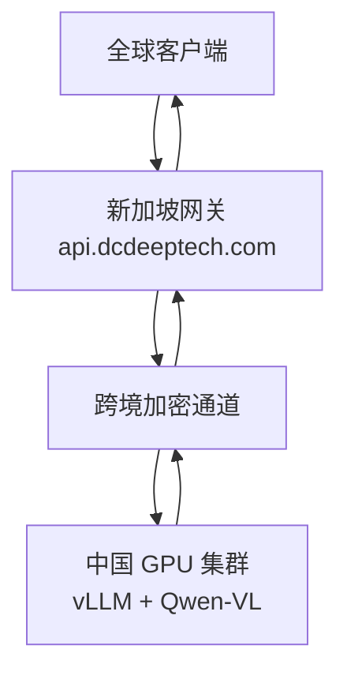

# 🌏 DCDeepTech AI 网关 — 新加坡–中国

**新加坡—中国跨境 AI 网关（OpenAI 兼容接口）**


> **代码仓库：** `github.com/luoxisg/dcdeeptech` · 分支 `main/SG-CN`
> **网关域名：** `api.dcdeeptech.com`

---

## 📑 目录

- [项目概述](#项目概述)
- [架构](#架构)
- [功能特性](#功能特性)
- [技术栈](#技术栈)
- [项目结构](#项目结构)
- [安装](#安装)
- [配置](#配置)
- [启动](#启动)
- [接口使用](#接口使用)
- [获取 API Key](#获取-api-key)
- [计费说明](#计费说明)
- [生产特性说明](#生产特性说明)
- [验收标准](#验收标准)
- [路线图](#路线图)

---

## 项目概述

本项目实现了 `api.dcdeeptech.com` 的核心网关逻辑。它被设计为部署在新加坡侧的 API 层，位于全球客户端与中国侧推理基础设施之间，对外提供 OpenAI 兼容接口，同时处理鉴权、请求规范化、响应适配、流式传输和运行可观测性。

```
全球客户端
      ↓  Authorization: Bearer <GATEWAY_API_KEY>
新加坡网关 — api.dcdeeptech.com
      ↓  跨境通道
      ↓  Authorization: Bearer <SOPHNET_API_KEY>
中国 GPU 集群 — vLLM + Qwen-VL
      ↓
OpenAI 兼容响应
```

> **部署区域：** 新加坡 `ap-southeast-1`

---

## 架构



### 网关职责

- 对外暴露 OpenAI 兼容接口
- 使用 Bearer Token 对客户端请求进行鉴权
- 将请求转发到上游推理服务
- 将上游响应规范化为 OpenAI 格式
- 支持 Qwen-VL 多模态（图文）输入
- 支持普通与流式聊天补全
- 健康检查、模型列表、日志与请求追踪

---

## 功能特性

| 功能 | 说明 |
|---|---|
| **OpenAI 兼容接口** | 仅替换 Base URL，无需修改客户端代码 |
| **多模态支持** | Qwen-VL 支持图文混合输入 |
| **Bearer Token 鉴权** | 与 OpenAI 鉴权方式一致 |
| **跨境路由** | 新加坡 ↔ 中国优化链路 |
| **协议适配** | 将 vLLM 响应标准化为 OpenAI schema |
| **SSE 流式代理** | 禁用 Nginx 缓冲，保证实时推送 |
| **健康检查** | `/health` 含上游连通性探测 |
| **请求追踪** | 每个响应携带 `X-Request-ID` |
| **参数透传** | `extra="allow"` 自动透传未知 OAI 参数 |

---

## 技术栈

| 组件 | 技术 |
|---|---|
| 网关框架 | FastAPI |
| HTTP 客户端 | httpx（异步，共享客户端） |
| ASGI 服务器 | Uvicorn |
| 配置管理 | pydantic-settings + python-dotenv |
| 推理后端 | vLLM |
| 模型 | Qwen-VL（多模态） |
| 鉴权 | HTTPBearer 中间件 |

---

## 项目结构

所有源文件**平铺于 `SG-CN/` 目录下**，无 `routes/` 或 `utils/` 子包层级。

```
SG-CN/
├── main.py           # 应用入口：中间件、路由、生命周期
├── config.py         # 通过 pydantic-settings 加载 .env 中的环境变量
├── auth.py           # 所有 /v1/* 路由的 Bearer 鉴权依赖
├── models.py         # Pydantic 模型：文本 + image_url 多模态
├── adapters.py       # adapt_request / adapt_response / adapt_model_list
├── chat.py           # POST /v1/chat/completions（流式 + 非流式）
├── health.py         # GET /health — 上游探测，无需鉴权
├── logging.py        # configure_logging()，压低第三方库噪音
├── request_id.py     # RequestIDMiddleware — X-Request-ID 请求头
├── mvp.py            # 单文件 PoC 原型（仅供参考）
├── .env.example      # 环境变量模板
├── Dockerfile        # python:3.12-slim，uvicorn 入口
├── requirements.txt  # 运行时 + 测试依赖
├── tests/            # pytest 测试套件（鉴权、对话、健康检查、模型、适配器）
├── MVP.md            # PoC 设计说明
├── README01.md       # 原始生成 README
└── readme02.md       # 架构深度解析 README
```

### 文件说明

| 文件 | 功能 |
|---|---|
| `main.py` | 应用工厂与生命周期，共享 `httpx.AsyncClient` 初始化，挂载中间件与路由。 |
| `config.py` | 通过 `pydantic-settings` 加载全部环境变量并做类型转换。 |
| `auth.py` | Bearer 鉴权依赖，通过 `Depends(verify_api_key)` 统一注入所有 `/v1/*` 路由。 |
| `models.py` | 完整 Pydantic 模型，含多模态 `image_url` 内容部分（`ContentPart`、`ChatMessage`、`ChatCompletionRequest` 等）。 |
| `adapters.py` | 三个协议归一化函数：`adapt_request_to_upstream`、`adapt_response_to_openai`、`adapt_model_list_to_openai`。 |
| `chat.py` | `POST /v1/chat/completions`，流式通过 `httpx.stream()` + `X-Accel-Buffering: no` 实现；非流式返回完整 JSON。 |
| `health.py` | `GET /health`，尽力探测上游；上游失败不影响端点本身返回 200。 |
| `logging.py` | `configure_logging()`，干净的 stdout 格式，压低 `httpx`/`uvicorn` 噪音。 |
| `request_id.py` | Starlette 中间件，为每对请求/响应注入 `X-Request-ID`。 |
| `mvp.py` | 初期 PoC 单文件原型，仅供参考。 |

**共约 840 行面向生产环境的 Python 代码。**

---

## 安装

```bash
# 仅拉取 SG-CN/ 目录（稀疏检出）
git clone --no-checkout https://github.com/luoxisg/dcdeeptech.git
cd dcdeeptech
git sparse-checkout init --cone
git sparse-checkout set SG-CN
git checkout main
cd SG-CN

# 或克隆完整仓库
# git clone https://github.com/luoxisg/dcdeeptech.git && cd dcdeeptech/SG-CN

# 创建虚拟环境
python3.12 -m venv .venv
source .venv/bin/activate        # Windows: .venv\Scripts\activate

# 安装依赖
pip install -r requirements.txt
```

---

## 配置

将 `.env.example` 复制为 `.env` 并填写真实值：

```bash
cp .env.example .env
```

```env
# 网关配置
GATEWAY_API_KEY=your-gateway-api-key
GATEWAY_HOST=0.0.0.0
GATEWAY_PORT=8000

# 上游中国侧推理服务
SOPHNET_API_URL=https://your-china-endpoint
SOPHNET_API_KEY=your-upstream-key
SOPHNET_AUTH_MODE=bearer

# 模型与超时
DEFAULT_MODEL=qwenvl
REQUEST_TIMEOUT=60
```

| 变量 | 必填 | 说明 |
|---|---|---|
| `GATEWAY_API_KEY` | ✅ | 客户端鉴权 Token |
| `GATEWAY_HOST` | | 绑定地址，默认 `0.0.0.0` |
| `GATEWAY_PORT` | | 监听端口，默认 `8000` |
| `SOPHNET_API_URL` | ✅ | 中国侧推理服务接入地址 |
| `SOPHNET_API_KEY` | ✅ | 上游 API Key |
| `SOPHNET_AUTH_MODE` | | `bearer`（默认）或 `none` |
| `DEFAULT_MODEL` | | 默认模型名，默认 `qwenvl` |
| `REQUEST_TIMEOUT` | | 上游超时秒数，默认 `60` |

> ⚠️ **请勿将 `.env` 提交至 git，`.gitignore` 已默认排除该文件。**

---

## 启动

### 本地开发

```bash
uvicorn main:app --host 0.0.0.0 --port 8000 --reload
```

或使用内置入口：

```bash
python main.py
```

### 生产环境（新加坡服务器）

```bash
uvicorn main:app --host 0.0.0.0 --port 8000 --workers 4
```

> 纯异步负载单 worker 即可，建议通过水平扩容（多副本）替代多 worker。

### systemd 持久运行

```bash
sudo tee /etc/systemd/system/ai-gateway.service > /dev/null <<'EOF'
[Unit]
Description=DCDeepTech AI Gateway (SG-CN)
After=network.target

[Service]
User=ubuntu
WorkingDirectory=/home/ubuntu/dcdeeptech/SG-CN
EnvironmentFile=/home/ubuntu/dcdeeptech/SG-CN/.env
ExecStart=/home/ubuntu/dcdeeptech/SG-CN/.venv/bin/uvicorn \
          main:app --host 0.0.0.0 --port 8000
Restart=always
RestartSec=5

[Install]
WantedBy=multi-user.target
EOF

sudo systemctl daemon-reload
sudo systemctl enable --now ai-gateway
sudo journalctl -u ai-gateway -f   # 实时日志
```

### Docker 容器部署

```bash
# 构建镜像
docker build -t dcdeeptech-gateway .

# 运行容器
docker run -d \
  --name gateway \
  --env-file .env \
  -p 8000:8000 \
  --restart unless-stopped \
  dcdeeptech-gateway

# 查看日志
docker logs -f gateway
```

---

## 接口使用

**Base URL：** `https://api.dcdeeptech.com`（生产）或 `http://localhost:8000`（本地）

使用官方 OpenAI Python SDK，仅替换 `base_url`：

```python
from openai import OpenAI

client = OpenAI(
    base_url="https://api.dcdeeptech.com/v1",
    api_key="your-gateway-api-key",
)

response = client.chat.completions.create(
    model="qwenvl",
    messages=[{"role": "user", "content": "你好，来自新加坡！"}],
)
print(response.choices[0].message.content)
```

---

### `GET /health` — 健康检查

无需鉴权。

```bash
curl https://api.dcdeeptech.com/health
```

```json
{
  "status": "ok",
  "service": "DCDeepTech AI Gateway",
  "region": "Singapore",
  "timestamp": 1710000000,
  "upstream": { "reachable": true, "status": 200 }
}
```

---

### `GET /v1/models` — 模型列表

```bash
curl https://api.dcdeeptech.com/v1/models \
  -H "Authorization: Bearer $GATEWAY_API_KEY"
```

```json
{
  "object": "list",
  "data": [
    { "id": "qwenvl", "object": "model", "created": 1710000000, "owned_by": "dcdeeptech" }
  ]
}
```

---

### `POST /v1/chat/completions` — 文本对话

```bash
curl https://api.dcdeeptech.com/v1/chat/completions \
  -H "Authorization: Bearer $GATEWAY_API_KEY" \
  -H "Content-Type: application/json" \
  -d '{
    "model": "qwenvl",
    "messages": [{"role": "user", "content": "新加坡的首都是哪里？"}]
  }'
```

---

### 流式输出

```bash
curl https://api.dcdeeptech.com/v1/chat/completions \
  -H "Authorization: Bearer $GATEWAY_API_KEY" \
  -H "Content-Type: application/json" \
  -d '{
    "model": "qwenvl",
    "stream": true,
    "messages": [{"role": "user", "content": "讲个笑话。"}]
  }'
```

---

### 多模态图片输入（Qwen-VL）

```bash
curl https://api.dcdeeptech.com/v1/chat/completions \
  -H "Authorization: Bearer $GATEWAY_API_KEY" \
  -H "Content-Type: application/json" \
  -d '{
    "model": "qwenvl",
    "messages": [{
      "role": "user",
      "content": [
        {"type": "image_url", "image_url": {"url": "https://example.com/image.jpg"}},
        {"type": "text", "text": "请描述这张图片。"}
      ]
    }]
  }'
```

> 本地测试时将域名替换为 `http://localhost:8000`。

---

## 获取 API Key

> POC 阶段目前通过**邀请 / 申请**方式开放。

### 申请方式

1. 发送邮件至 **[info@dcdeeptech.com](mailto:info@dcdeeptech.com)**，主题：`API Key 申请`
2. 注明姓名、公司及使用场景
3. 1–2 个工作日内收到 `sk-xxxx` 格式的 Key

### 你将获得

| 内容 | 详情 |
|---|---|
| API Key | `sk-xxxxxxxxxxxxxxxx` — 请妥善保管，勿提交至 git |
| Base URL | `https://api.dcdeeptech.com` |
| 默认配额 | 每日 10 万 tokens（POC 档）|
| 可用模型 | `qwenvl`（文本 + 多模态） |

```bash
# 推荐：设为环境变量
export DCDEEPTECH_API_KEY="sk-xxxx"

curl https://api.dcdeeptech.com/v1/chat/completions \
  -H "Authorization: Bearer $DCDEEPTECH_API_KEY" \
  ...
```

> ⚠️ **安全提示：** 若怀疑 Key 泄露，请立即发邮件至 [info@dcdeeptech.com](mailto:info@dcdeeptech.com) 申请轮换。

---

## 计费说明

> 当前为 POC 阶段定价，Phase 2 上线正式计费系统后可能调整。

### Token 定价 — Qwen-VL

| 类型 | 单位 | 价格（美元） |
|---|---|---|
| 输入 Token（文本） | 每 100 万 tokens | $0.50 |
| 输出 Token（文本） | 每 100 万 tokens | $1.50 |
| 输入（图片） | 每张 | $0.003 |
| 最低消费 | 每次请求 | 无 |

> **示例：** 500 输入 + 200 输出 tokens ≈ **$0.00058**

### POC 免费额度

| 档位 | 配额 | 费用 |
|---|---|---|
| POC 开发者 | 每日 10 万 tokens | POC 期间**免费** |
| 超额 | 超出每日配额 | 返回 `429`，联系升级 |

### 计费说明

- 文本 Token 计数遵循 **OpenAI tiktoken** 规范
- 图片按每张固定费率，不区分分辨率（POC 阶段）
- 流式（`"stream": true`）与非流式计费方式相同
- 用量日志可按需提供；Phase 3 上线自助控制台

### 未来定价规划（Phase 2）

| 档位 | 月用量 | 预估价格 |
|---|---|---|
| 入门版 | 最多 1000 万 tokens | 约 $10 / 月 |
| 成长版 | 最多 1 亿 tokens | 约 $80 / 月 |
| 企业版 | 定制 | 联系我们 |

---

## 生产特性说明

### 1. 共享异步 HTTP 客户端

通过 `app.state` 全局共享单个 `httpx.AsyncClient`，避免每次请求重建 TCP 连接。对跨境链路而言，减少重复握手能显著改善延迟。

### 2. 流式异常处理

上游流式传输异常时，网关不会中途崩溃，而是返回有效的 SSE `data:` 错误事件，客户端可收到干净、协议兼容的失败信号。

### 3. 未知参数透传

`ChatCompletionRequest` 使用 `model_config = {"extra": "allow"}`，未知 OAI 兼容参数（如 `logit_bias`、`seed`、`tools`）自动透传，无需预先逐一建模，对新版 SDK 具有天然前向兼容性。

### 4. 无状态设计

网关不持有任何请求级状态，可安全在负载均衡后运行多副本，通过容器/K8s 水平扩容。

### 5. 密钥安全

`GATEWAY_API_KEY` 与 `SOPHNET_API_KEY` 均不写入日志。每个请求生成 `X-Request-ID` 并在响应中回显，便于分布式追踪。

---

## 验收标准

| 验收项 | 目标 |
|---|---|
| 新加坡可正常调用 API | ✅ |
| 文本响应正确 | ✅ |
| 多模态响应正确（图文输入，Qwen-VL） | ✅ |
| 成功率 | ≥ 95% |
| 文本 P99 延迟 | ≤ 5s |

---

## 路线图

| 阶段 | 范围 | 状态 |
|---|---|---|
| Phase 1 | POC — 基础路由、Qwen-VL、新加坡部署 | 🟡 进行中 |
| Phase 2 | 计费 — 用量计量、按 Key 配额、控制台 | ⬜ 规划中 |
| Phase 3 | 平台 — 多模型、高可用、自助门户 | ⬜ 规划中 |

---

## 许可证

MIT

---

> **联系我们：** [info@dcdeeptech.com](mailto:info@dcdeeptech.com)
> **文档：** 详见 `MVP.md`（PoC 设计说明）· `README01.md` / `readme02.md`（架构深度解析）
