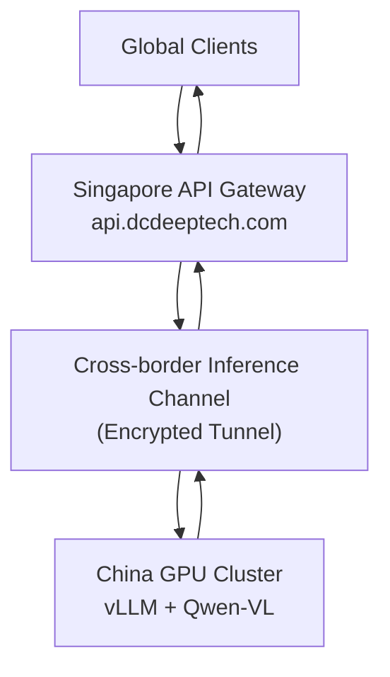

 # 🌏 SG-CN AI Gateway POC

**Singapore–China Cross-Border AI Gateway (OpenAI-Compatible)**


---

## 📑 Table of Contents

- [Overview](#overview)
- [Architecture](#architecture)
- [Features](#features)
- [Tech Stack](#tech-stack)
- [Installation](#installation)
- [Configuration](#configuration)
- [Run](#run)
- [API Usage](#api-usage)
- [Project Structure](#project-structure)
- [Get API Key](#get-api-key)
- [Pricing](#pricing)
- [Success Criteria](#success-criteria)
- [Roadmap](#roadmap)
- [中文版本](#中文版本)

---

## 📌 Overview

This project demonstrates a minimal cross-border AI inference architecture, deployed in Singapore as the gateway node.

```
Global Clients → Singapore API Gateway (api.dcdeeptech.com) → Cross-border Channel → China GPU / vLLM → Response
```

> **Deployment Region:** Singapore (AWS ap-southeast-1 / GCP asia-southeast1 recommended)

---

## 🧱 Architecture



---

## ✨ Features

- **OpenAI-compatible API** — drop-in replacement, just swap the base URL
- **Multimodal support** — Qwen-VL handles text + image inputs
- **API Key authentication** — Bearer token, same as OpenAI
- **Cross-border routing** — Singapore ↔ China optimised tunnel
- **Protocol adapter** — normalises upstream vLLM responses to OpenAI schema
- **Health check endpoint** — `/health` for uptime monitoring
- **Basic observability** — request logging, latency tracking

---

## 🛠 Tech Stack

| Component | Technology |
|-----------|-----------|
| Gateway Framework | FastAPI |
| HTTP Client | httpx (async) |
| ASGI Server | Uvicorn |
| Inference Backend | vLLM |
| Model | Qwen-VL (multimodal) |
| Auth | Bearer token middleware |

---

## 📦 Installation

```bash
git clone https://github.com/your-org/sg-cn-ai-gateway-poc.git
cd sg-cn-ai-gateway-poc

python -m venv .venv
source .venv/bin/activate   # Windows: .venv\Scripts\activate

pip install -r requirements.txt
```

---

## 🔑 Configuration

Copy `.env.example` to `.env` and fill in your values:

```bash
# Gateway settings
GATEWAY_API_KEY="your-gateway-api-key"
GATEWAY_HOST="0.0.0.0"
GATEWAY_PORT="8000"

# Upstream inference endpoint (China-side vLLM)
SOPHNET_API_URL="https://your-china-endpoint"
SOPHNET_API_KEY="your-upstream-key"
SOPHNET_AUTH_MODE="bearer"

# Model
DEFAULT_MODEL="qwenvl"

# Optional: timeout (seconds)
REQUEST_TIMEOUT="60"
```

---

## 🚀 Run

**Local / development:**

```bash
uvicorn main:app --host 0.0.0.0 --port 8000 --reload
```

**Production (Singapore server):**

```bash
uvicorn main:app --host 0.0.0.0 --port 8000 --workers 4
```

**Docker (recommended for Singapore deployment):**

```bash
docker build -t sg-cn-gateway .
docker run -d --env-file .env -p 8000:8000 sg-cn-gateway
```

---

## 🔌 API Usage

Base URL: `https://api.dcdeeptech.com` (or `http://localhost:8000` locally)

### Health Check

```bash
curl https://api.dcdeeptech.com/health
```

### Text Inference

```bash
curl https://api.dcdeeptech.com/v1/chat/completions \
  -H "Authorization: Bearer sk-xxxx" \
  -H "Content-Type: application/json" \
  -d '{
    "model": "qwenvl",
    "messages": [{"role": "user", "content": "Hello"}]
  }'
```

### Multimodal (Image + Text) — Qwen-VL

```bash
curl https://api.dcdeeptech.com/v1/chat/completions \
  -H "Authorization: Bearer sk-xxxx" \
  -H "Content-Type: application/json" \
  -d '{
    "model": "qwenvl",
    "messages": [{
      "role": "user",
      "content": [
        {"type": "image_url", "image_url": {"url": "https://example.com/image.jpg"}},
        {"type": "text", "text": "Describe this image."}
      ]
    }]
  }'
```

### List Available Models

```bash
curl https://api.dcdeeptech.com/v1/models \
  -H "Authorization: Bearer sk-xxxx"
```

---

## 📁 Project Structure

```
sg-cn-gateway/
├── main.py               # FastAPI app entry point
├── requirements.txt
├── .env.example
├── Dockerfile
├── README.md
└── adapter/
    ├── __init__.py
    ├── protocol.py       # OpenAI ↔ vLLM schema adapter
    ├── auth.py           # API key middleware
    └── router.py         # Cross-border routing logic
```

---

## 🔐 Get API Key

> Developer access is currently available via **invitation / waitlist** during the POC phase.

### How to Apply

1. Email **[dev@dcdeeptech.com](mailto:dev@dcdeeptech.com)** with subject: `API Key Request`
2. Include your name, company, and intended use case
3. You will receive a `sk-xxxx` key within 1–2 business days

### What You'll Receive

| Item | Detail |
|------|--------|
| API Key | `sk-xxxxxxxxxxxxxxxx` (keep secret, never commit to git) |
| Base URL | `https://api.dcdeeptech.com` |
| Default Quota | 100,000 tokens / day (POC tier) |
| Models Access | `qwenvl` (text + multimodal) |

### Key Management

```bash
# Set as environment variable (recommended)
export DCDEEPTECH_API_KEY="sk-xxxx"

# Use in requests
curl https://api.dcdeeptech.com/v1/chat/completions \
  -H "Authorization: Bearer $DCDEEPTECH_API_KEY" \
  ...
```

> ⚠️ **Security:** Rotate your key immediately at [dev@dcdeeptech.com](mailto:dev@dcdeeptech.com) if you suspect it has been compromised.

---

## 💰 Pricing

> POC phase pricing — subject to change in Phase 2 (Billing).

### Token Pricing (Qwen-VL)

| Type | Unit | Price (USD) |
|------|------|-------------|
| Input tokens (text) | per 1M tokens | $0.50 |
| Output tokens (text) | per 1M tokens | $1.50 |
| Input tokens (image) | per image | $0.003 |
| Minimum charge | per request | — (no minimum) |

> **Example:** A request with 500 input tokens + 200 output tokens costs approximately **$0.00058**.

### POC Free Tier

| Tier | Quota | Price |
|------|-------|-------|
| POC Developer | 100,000 tokens / day | **Free** (during POC) |
| Overage | Beyond daily quota | Requests return `429` — contact us to upgrade |

### Billing Notes

- Token counting follows the **OpenAI tiktoken** convention for text
- Images are counted as a **flat fee per image** regardless of resolution (during POC)
- Streaming responses (`"stream": true`) are billed identically to non-streaming
- Usage logs available on request — self-serve dashboard coming in Phase 3

### Future Pricing (Phase 2 Roadmap)

| Tier | Monthly Volume | Estimated Price |
|------|---------------|-----------------|
| Starter | up to 10M tokens | ~$10 / month |
| Growth | up to 100M tokens | ~$80 / month |
| Enterprise | Custom | Contact us |

---

## 📊 Success Criteria

| Criteria | Target |
|----------|--------|
| API callable from Singapore | ✅ |
| Correct response (text) | ✅ |
| Correct response (image+text via Qwen-VL) | ✅ |
| Success rate | ≥ 95% |
| P99 latency (text) | ≤ 5s |

---

## 🛣 Roadmap

| Phase | Scope | Status |
|-------|-------|--------|
| Phase 1 | POC — basic routing, Qwen-VL, Singapore deploy | 🟡 In Progress |
| Phase 2 | Billing — usage metering, per-key quotas | ⬜ Planned |
| Phase 3 | Platform — dashboard, multi-model, HA | ⬜ Planned |

---

## 📄 License

MIT

---

---

# 中文版本

# 🌏 新加坡—中国跨境 AI 网关 POC

---

## 📌 项目概述

本项目用于验证跨境 AI 调用架构，以新加坡为网关节点对外提供服务：

```
海外客户端 → 新加坡 API 网关 (api.dcdeeptech.com) → 跨境通道 → 中国 GPU 算力 → 返回
```

> **部署区域：** 新加坡（推荐 AWS ap-southeast-1 或 GCP asia-southeast1）

---

## 🧱 架构

同英文部分

---

## ✨ 功能

- **OpenAI 兼容接口** — 仅需替换 Base URL，无需修改客户端代码
- **多模态支持** — Qwen-VL 支持图文混合输入
- **API Key 鉴权** — Bearer Token，与 OpenAI 一致
- **跨境路由** — 新加坡 ↔ 中国优化链路
- **协议适配** — 将 vLLM 响应标准化为 OpenAI schema
- **健康检查** — `/health` 接口，便于监控

---

## 📦 安装

同英文部分

---

## 🚀 启动

同英文部分

---

## 👨‍💻 客户使用方式

### 使用方式

与 OpenAI 完全一致，只需替换 Base URL：

```
https://api.openai.com  →  https://api.dcdeeptech.com
```

### 必需信息

| 参数 | 值 |
|------|---|
| API 地址 | `https://api.dcdeeptech.com/v1/chat/completions` |
| API Key | `Authorization: Bearer sk-xxxx` |
| 文本模型 | `qwenvl` |
| 多模态模型 | `qwenvl` （支持图文） |

### 文本调用示例

```bash
curl https://api.dcdeeptech.com/v1/chat/completions \
  -H "Authorization: Bearer sk-demo" \
  -H "Content-Type: application/json" \
  -d '{"model":"qwenvl","messages":[{"role":"user","content":"你好"}]}'
```

### 多模态调用示例（图文）

```bash
curl https://api.dcdeeptech.com/v1/chat/completions \
  -H "Authorization: Bearer sk-demo" \
  -H "Content-Type: application/json" \
  -d '{
    "model": "qwenvl",
    "messages": [{
      "role": "user",
      "content": [
        {"type": "image_url", "image_url": {"url": "https://example.com/image.jpg"}},
        {"type": "text", "text": "请描述这张图片"}
      ]
    }]
  }'
```

---

## 🔐 获取 API Key（开发者入口）

> POC 阶段目前通过**邀请 / 申请**方式开放。

### 申请方式

1. 发送邮件至 **[dev@dcdeeptech.com](mailto:dev@dcdeeptech.com)**，主题：`API Key 申请`
2. 注明姓名、公司及使用场景
3. 1–2 个工作日内收到 `sk-xxxx` Key

### 你将获得

| 内容 | 详情 |
|------|------|
| API Key | `sk-xxxxxxxxxxxxxxxx`（请勿提交至代码仓库） |
| Base URL | `https://api.dcdeeptech.com` |
| 默认配额 | 每日 100,000 tokens（POC 档） |
| 可用模型 | `qwenvl`（文本 + 多模态） |

### Key 使用方式

```bash
export DCDEEPTECH_API_KEY="sk-xxxx"

curl https://api.dcdeeptech.com/v1/chat/completions \
  -H "Authorization: Bearer $DCDEEPTECH_API_KEY" \
  ...
```

> ⚠️ **安全提示：** 若怀疑 Key 泄露，请立即发邮件至 [dev@dcdeeptech.com](mailto:dev@dcdeeptech.com) 申请轮换。

---

## 💰 计费说明（Token Pricing）

> 当前为 POC 阶段定价，Phase 2 上线正式计费系统后可能调整。

### Qwen-VL Token 价格

| 类型 | 单位 | 价格（USD） |
|------|------|------------|
| 输入 Token（文本） | 每 100 万 tokens | $0.50 |
| 输出 Token（文本） | 每 100 万 tokens | $1.50 |
| 输入（图片） | 每张图片 | $0.003 |
| 最低消费 | 每次请求 | 无 |

> **示例：** 500 输入 tokens + 200 输出 tokens，费用约 **$0.00058**。

### POC 免费额度

| 档位 | 配额 | 费用 |
|------|------|------|
| POC 开发者 | 每日 100,000 tokens | **免费**（POC 期间） |
| 超额 | 超出每日配额后 | 返回 `429`，联系我们升级 |

### 计费说明

- 文本 Token 计数遵循 **OpenAI tiktoken** 规范
- 图片按**每张固定费率**计费（POC 阶段不区分分辨率）
- 流式响应（`"stream": true`）与非流式计费方式相同
- 用量日志可按需提供，自助控制台将在 Phase 3 上线

### 未来定价（Phase 2 规划）

| 档位 | 月用量 | 预估价格 |
|------|-------|---------|
| 入门版 | 1000 万 tokens 以内 | ~$10 / 月 |
| 成长版 | 1 亿 tokens 以内 | ~$80 / 月 |
| 企业版 | 定制 | 联系我们 |

---

## 🧠 结论

本 POC 验证了以新加坡为枢纽的跨境 AI 基础设施层，支持多模态模型（Qwen-VL）的跨境推理调用，为后续商业化平台奠定基础。
