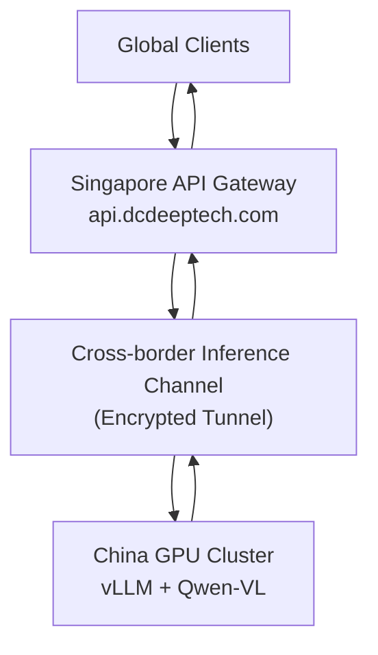

 # 🌏 SG-CN AI Gateway POC

**Singapore–China Cross-Border AI Gateway (OpenAI-Compatible)**


---

## 📑 Table of Contents

- [Overview](#overview)
- [Architecture](#architecture)
- [Features](#features)
- [Tech Stack](#tech-stack)
- [Installation](#installation)
- [Configuration](#configuration)
- [Run](#run)
- [API Usage](#api-usage)
- [Project Structure](#project-structure)
- [Success Criteria](#success-criteria)
- [Roadmap](#roadmap)
- [中文版本](#中文版本)

---

## 📌 Overview

This project demonstrates a minimal cross-border AI inference architecture, deployed in Singapore as the gateway node.

```
Global Clients → Singapore API Gateway (api.dcdeeptech.com) → Cross-border Channel → China GPU / vLLM → Response
```

> **Deployment Region:** Singapore (AWS ap-southeast-1 / GCP asia-southeast1 recommended)

---

## 🧱 Architecture



---

## ✨ Features

- **OpenAI-compatible API** — drop-in replacement, just swap the base URL
- **Multimodal support** — Qwen-VL handles text + image inputs
- **API Key authentication** — Bearer token, same as OpenAI
- **Cross-border routing** — Singapore ↔ China optimised tunnel
- **Protocol adapter** — normalises upstream vLLM responses to OpenAI schema
- **Health check endpoint** — `/health` for uptime monitoring
- **Basic observability** — request logging, latency tracking

---

## 🛠 Tech Stack

| Component | Technology |
|-----------|-----------|
| Gateway Framework | FastAPI |
| HTTP Client | httpx (async) |
| ASGI Server | Uvicorn |
| Inference Backend | vLLM |
| Model | Qwen-VL (multimodal) |
| Auth | Bearer token middleware |

---

## 📦 Installation

```bash
git clone https://github.com/your-org/sg-cn-ai-gateway-poc.git
cd sg-cn-ai-gateway-poc

python -m venv .venv
source .venv/bin/activate   # Windows: .venv\Scripts\activate

pip install -r requirements.txt
```

---

## 🔑 Configuration

Copy `.env.example` to `.env` and fill in your values:

```bash
# Gateway settings
GATEWAY_API_KEY="your-gateway-api-key"
GATEWAY_HOST="0.0.0.0"
GATEWAY_PORT="8000"

# Upstream inference endpoint (China-side vLLM)
SOPHNET_API_URL="https://your-china-endpoint"
SOPHNET_API_KEY="your-upstream-key"
SOPHNET_AUTH_MODE="bearer"

# Model
DEFAULT_MODEL="qwenvl"

# Optional: timeout (seconds)
REQUEST_TIMEOUT="60"
```

---

## 🚀 Run

**Local / development:**

```bash
uvicorn main:app --host 0.0.0.0 --port 8000 --reload
```

**Production (Singapore server):**

```bash
uvicorn main:app --host 0.0.0.0 --port 8000 --workers 4
```

**Docker (recommended for Singapore deployment):**

```bash
docker build -t sg-cn-gateway .
docker run -d --env-file .env -p 8000:8000 sg-cn-gateway
```

---

## 🔌 API Usage

Base URL: `https://api.dcdeeptech.com` (or `http://localhost:8000` locally)

### Health Check

```bash
curl https://api.dcdeeptech.com/health
```

### Text Inference

```bash
curl https://api.dcdeeptech.com/v1/chat/completions \
  -H "Authorization: Bearer sk-xxxx" \
  -H "Content-Type: application/json" \
  -d '{
    "model": "qwenvl",
    "messages": [{"role": "user", "content": "Hello"}]
  }'
```

### Multimodal (Image + Text) — Qwen-VL

```bash
curl https://api.dcdeeptech.com/v1/chat/completions \
  -H "Authorization: Bearer sk-xxxx" \
  -H "Content-Type: application/json" \
  -d '{
    "model": "qwenvl",
    "messages": [{
      "role": "user",
      "content": [
        {"type": "image_url", "image_url": {"url": "https://example.com/image.jpg"}},
        {"type": "text", "text": "Describe this image."}
      ]
    }]
  }'
```

### List Available Models

```bash
curl https://api.dcdeeptech.com/v1/models \
  -H "Authorization: Bearer sk-xxxx"
```

---

## 📁 Project Structure

```
sg-cn-gateway/
├── main.py               # FastAPI app entry point
├── requirements.txt
├── .env.example
├── Dockerfile
├── README.md
└── adapter/
    ├── __init__.py
    ├── protocol.py       # OpenAI ↔ vLLM schema adapter
    ├── auth.py           # API key middleware
    └── router.py         # Cross-border routing logic
```

---

## 📊 Success Criteria

| Criteria | Target |
|----------|--------|
| API callable from Singapore | ✅ |
| Correct response (text) | ✅ |
| Correct response (image+text via Qwen-VL) | ✅ |
| Success rate | ≥ 95% |
| P99 latency (text) | ≤ 5s |

---

## 🛣 Roadmap

| Phase | Scope | Status |
|-------|-------|--------|
| Phase 1 | POC — basic routing, Qwen-VL, Singapore deploy | 🟡 In Progress |
| Phase 2 | Billing — usage metering, per-key quotas | ⬜ Planned |
| Phase 3 | Platform — dashboard, multi-model, HA | ⬜ Planned |

---

## 📄 License

MIT

---

---

# 中文版本

# 🌏 新加坡—中国跨境 AI 网关 POC

---

## 📌 项目概述

本项目用于验证跨境 AI 调用架构，以新加坡为网关节点对外提供服务：

```
海外客户端 → 新加坡 API 网关 (api.dcdeeptech.com) → 跨境通道 → 中国 GPU 算力 → 返回
```

> **部署区域：** 新加坡（推荐 AWS ap-southeast-1 或 GCP asia-southeast1）

---

## 🧱 架构

同英文部分

---

## ✨ 功能

- **OpenAI 兼容接口** — 仅需替换 Base URL，无需修改客户端代码
- **多模态支持** — Qwen-VL 支持图文混合输入
- **API Key 鉴权** — Bearer Token，与 OpenAI 一致
- **跨境路由** — 新加坡 ↔ 中国优化链路
- **协议适配** — 将 vLLM 响应标准化为 OpenAI schema
- **健康检查** — `/health` 接口，便于监控

---

## 📦 安装

同英文部分

---

## 🚀 启动

同英文部分

---

## 👨‍💻 客户使用方式

### 使用方式

与 OpenAI 完全一致，只需替换 Base URL：

```
https://api.openai.com  →  https://api.dcdeeptech.com
```

### 必需信息

| 参数 | 值 |
|------|---|
| API 地址 | `https://api.dcdeeptech.com/v1/chat/completions` |
| API Key | `Authorization: Bearer sk-xxxx` |
| 文本模型 | `qwenvl` |
| 多模态模型 | `qwenvl` （支持图文） |

### 文本调用示例

```bash
curl https://api.dcdeeptech.com/v1/chat/completions \
  -H "Authorization: Bearer sk-demo" \
  -H "Content-Type: application/json" \
  -d '{"model":"qwenvl","messages":[{"role":"user","content":"你好"}]}'
```

### 多模态调用示例（图文）

```bash
curl https://api.dcdeeptech.com/v1/chat/completions \
  -H "Authorization: Bearer sk-demo" \
  -H "Content-Type: application/json" \
  -d '{
    "model": "qwenvl",
    "messages": [{
      "role": "user",
      "content": [
        {"type": "image_url", "image_url": {"url": "https://example.com/image.jpg"}},
        {"type": "text", "text": "请描述这张图片"}
      ]
    }]
  }'
```

---

## 🧠 结论

本 POC 验证了以新加坡为枢纽的跨境 AI 基础设施层，支持多模态模型（Qwen-VL）的跨境推理调用，为后续商业化平台奠定基础。
